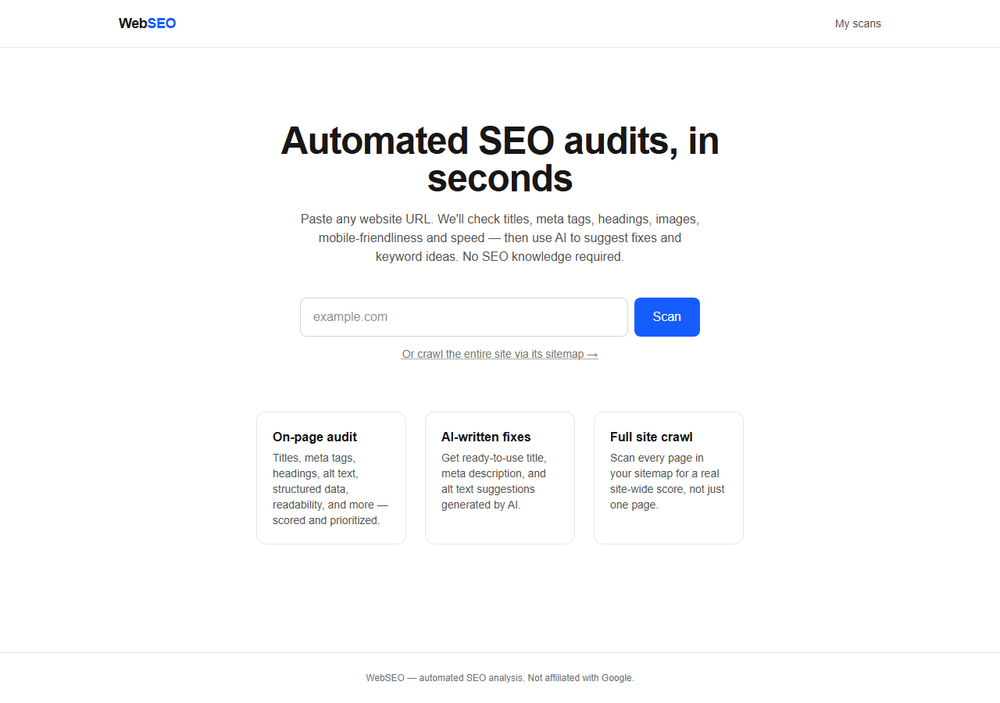
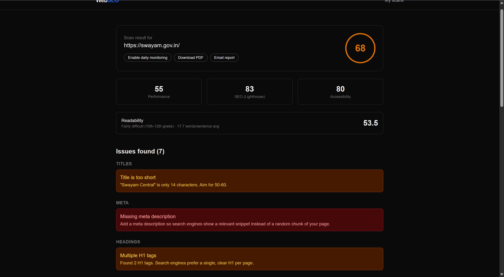
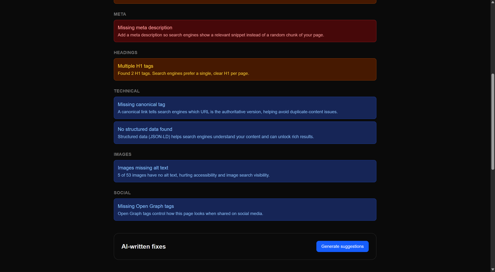
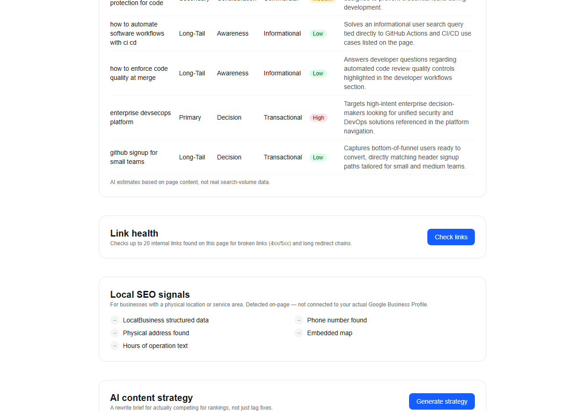
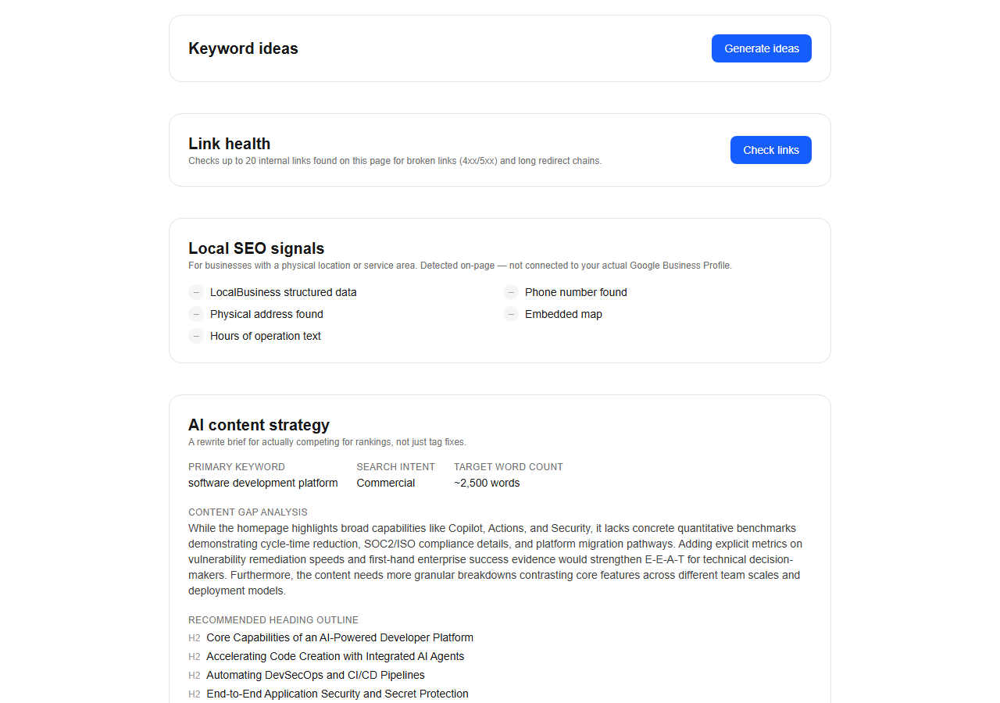
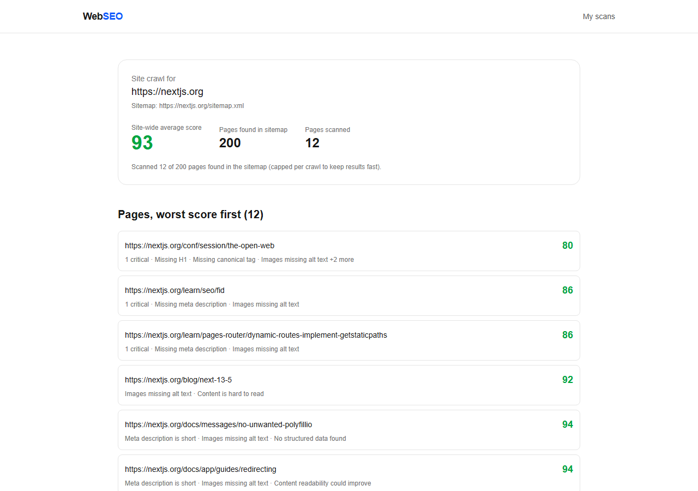
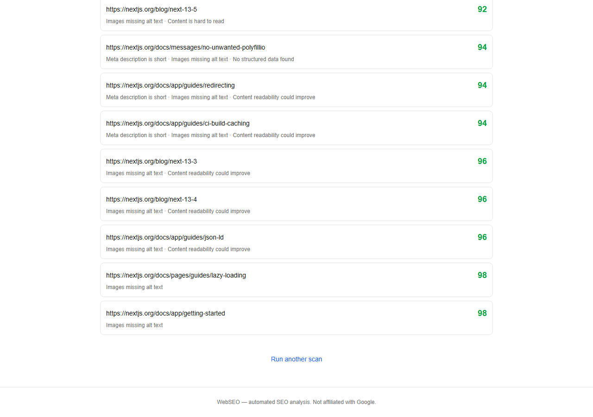
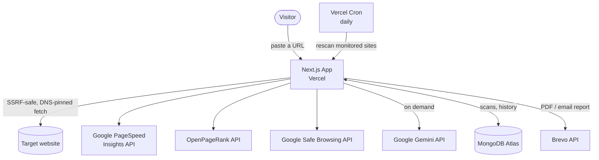

# WebSEO

**Automated, AI-powered SEO auditing for any website — no SEO knowledge required.**

🔗 **Live app:** [webseo-eosin.vercel.app](https://webseo-eosin.vercel.app)



---

## The problem

Most small businesses and independent site owners have no idea whether their website
is actually findable on Google. Real SEO tooling (Ahrefs, SEMrush, Moz) is expensive,
built for agencies, and assumes the user already understands terms like "canonical
tag" or "Core Web Vitals." The free alternatives are usually a single metric bolted
onto a lead-gen form.

**WebSEO** is a from-scratch, full-stack answer to "just tell me what's wrong with my
site and how to fix it" — paste a URL, get a scored audit in seconds, and let AI turn
technical findings into plain-English, prioritized fixes. No account, no credit card,
no jargon.

## Features

### Core audit (every scan, instant)
- Titles, meta descriptions, headings, canonical tags, robots directives, viewport/mobile setup, Open Graph, structured data, internal linking
- Real performance/SEO/accessibility scores via Google PageSpeed Insights (Lighthouse)
- **Domain Authority** (0–10, via [OpenPageRank](https://www.domcop.com/openpagerank/)) — a free, Common-Crawl-based alternative to paid DA metrics
- **Readability scoring** (Flesch Reading Ease), computed from actual page prose, not navigation chrome
- **Security headers audit** (HSTS, CSP, X-Frame-Options, etc.) — zero extra requests, analyzed from headers already fetched
- **Google Safe Browsing check** — flags malware/phishing sites; a flag dominates the score instead of hiding as a footnote
- **Local SEO signals** — on-page detection of LocalBusiness schema, phone, address, embedded map, hours text

### AI-powered (Google Gemini, on demand)
- **AI-written fixes**: rewritten title (with CTR rationale), meta description, H1, descriptive alt text, and concrete E-E-A-T trust signals to add
- **AI performance analysis**: PageSpeed's raw technical findings ("eliminate render-blocking resources") rewritten in plain English and prioritized by real-world impact
- **Keyword ideas**: a structured topic cluster (primary/secondary/long-tail, by funnel stage and intent) — not a flat keyword-stuffing list
- **AI content strategy**: a full rewrite brief — primary keyword, content gap analysis, recommended heading outline, target word count, internal linking ideas, schema markup suggestions
- **Competitor comparison**: scan a competitor's URL and get a score delta, gap analysis, and keyword/topic gaps

### Site-wide
- **Full site crawl** via sitemap discovery (robots.txt → sitemap.xml, handling sitemap indexes) — scores multiple pages for a real site-wide average, not a single-page snapshot
- **Sitemap & robots.txt validation** — catches a site-wide crawl block, malformed directives, cross-domain entries, missing `<lastmod>`, protocol limit violations
- **Broken link / redirect chain checker** — checks internal links for 4xx/5xx and long redirect chains
- **Daily monitoring** via Vercel Cron, with a score-trend chart (SEO score + PageSpeed performance over time)

### Reports
- **PDF export**, generated server-side (no headless browser)
- **Email delivery** of the PDF report via Brevo

## Screenshots

| | |
|---|---|
|  Scored audit with PageSpeed, readability, and prioritized issues |  Issues grouped by category, plus AI-written fixes |
|  Keyword ideas, link health, local SEO, competitor comparison |  Full AI rewrite brief with heading outline and schema suggestions |
|  Site-wide crawl summary with sitemap validation |  Every crawled page, worst score first |

## Architecture



Every external site fetch — the initial scan, competitor comparison, link checking,
sitemap discovery, and monitoring rescans — goes through the same SSRF-hardened path
(see [Security](#security) below), not a plain `fetch()`.

## Tech stack

| Layer | Choice | Why |
|---|---|---|
| Framework | Next.js 16 (App Router, TypeScript) | Frontend + API routes in one deployable, serverless-friendly |
| Database | MongoDB Atlas (free tier) | Flexible document shape fits variable-length audit results better than rigid tables |
| AI | Google Gemini API (free tier) | Structured JSON output (`responseSchema`) for every AI feature, no free-form parsing |
| Performance data | Google PageSpeed Insights (free) | Real Lighthouse lab data, not a guess |
| Domain authority | OpenPageRank (free) | Only legitimate free alternative to paid Moz/Ahrefs DA metrics |
| Safety | Google Safe Browsing v4 (free) | Malware/phishing detection, reuses the PageSpeed API key's GCP project |
| Email | Brevo (free tier) | Transactional email for report delivery |
| PDF | `@react-pdf/renderer` | Generates PDFs in plain Node — no headless Chromium on serverless |
| Hosting | Vercel | Serverless functions + Cron for daily monitoring |

## How a scan works

1. `POST /api/audit` validates and normalizes the URL, then fetches it **server-side**
   through an SSRF guard (see [Security](#security)).
2. The HTML is parsed (`src/lib/audit/parsePage.ts`) and scored against a rule set
   (`src/lib/audit/rules.ts`) covering ~15 on-page and technical SEO checks.
3. Concurrently: PageSpeed Insights, OpenPageRank, and Safe Browsing are queried —
   independent calls, run in parallel rather than one after another.
4. Response headers already fetched in step 1 are analyzed for security-header
   presence at zero extra cost.
5. Results are stored in MongoDB, keyed to an anonymous `httpOnly` cookie (no login) so
   a browser can revisit its scan history and enable daily monitoring.
6. Every AI feature (content fixes, keyword ideas, content strategy, performance
   explanation, competitor comparison) is generated **on demand** after the initial
   scan, keeping the first response fast.

## Security

This app fetches arbitrary user-submitted URLs server-side — the core SSRF attack
surface — and treats that as the primary threat model, not an afterthought:

- **DNS-rebinding-proof fetching**: every hostname is resolved and validated against
  private/reserved/loopback IP ranges (including IPv6 6to4/NAT64 transition prefixes),
  then the actual TCP connection is **pinned** to that validated IP via a custom
  undici `Agent` — closing the classic "check one IP, connect to a different one"
  DNS-rebinding gap that a naive resolve-then-fetch guard has.
- Every redirect hop is re-validated and re-pinned, not just the initial URL.
- Response bodies are size- and time-capped; non-HTML/XML responses are rejected.
- Rate limiting is keyed to both an anonymous visitor cookie *and* client IP, so
  clearing cookies alone doesn't bypass it.
- The cron endpoint's shared secret is compared with `crypto.timingSafeEqual`, not `===`.
- AI prompts wrap all scraped third-party content in explicit untrusted-data framing
  to reduce prompt-injection risk.
- A dedicated multi-agent security review and a manual hardening pass both fed back
  into the codebase during development (see commit history).

## Local setup

1. Copy `.env.example` to `.env.local` and fill in the variables (see table below).
2. Install and run:

```bash
npm install
npm run dev
```

Open http://localhost:3000.

### Environment variables

| Variable | Required? | Purpose |
|---|---|---|
| `MONGODB_URI` | Yes | MongoDB Atlas connection string |
| `GEMINI_API_KEY` | Yes, for AI features | Free key from [Google AI Studio](https://aistudio.google.com/apikey) |
| `PAGESPEED_API_KEY` | Optional | Google Cloud API key with PageSpeed Insights API enabled; also reused for Safe Browsing |
| `OPENPAGERANK_API_KEY` | Optional | Free key from [domcop.com/openpagerank](https://www.domcop.com/openpagerank/auth/signup) |
| `CRON_SECRET` | Yes, for monitoring | Any long random string; Vercel auto-sends it as a Bearer token to cron invocations |
| `BREVO_API_KEY` / `BREVO_FROM_EMAIL` | Optional | Enables "Email report"; free tier at [Brevo](https://app.brevo.com/settings/keys/api) |

Every integration degrades gracefully without its key — the app is fully usable with
just `MONGODB_URI` and `GEMINI_API_KEY` set.

## Deploy

Push to GitHub and import the repo in Vercel (or use the Vercel CLI). Set the same env
vars from `.env.example` in the Vercel project settings — Vercel automatically
authenticates its own daily cron call to `/api/cron/rescan` using `CRON_SECRET`.

## Project structure

```
src/
  app/
    api/            # Route handlers: audit, crawl, compare, links, strategy,
                     # performance-explain, report (pdf/email), cron
    results/[id]/    Single-scan results page
    crawl/[id]/      Site-crawl results page
    history/         Anonymous scan history
  lib/
    audit/          Crawler, SSRF guard, rules engine, sitemap discovery +
                     validation, readability, local SEO, security headers,
                     domain authority, Safe Browsing, link checker
    ai/gemini.ts    All Gemini prompts + structured schemas
    models/         Mongoose schemas (Scan, SiteCrawl)
    pdf/            @react-pdf/renderer report document
```

## License

MIT
